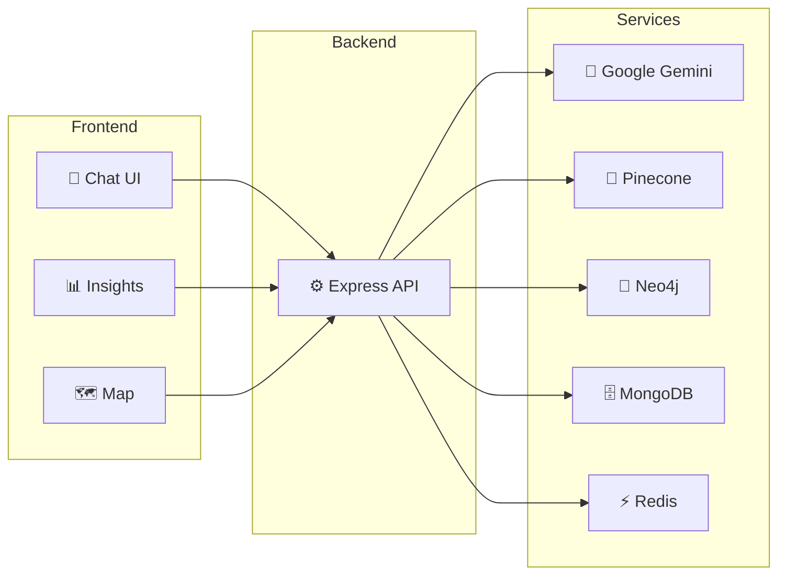
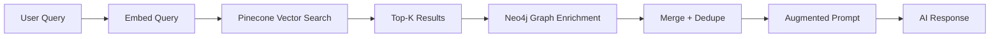
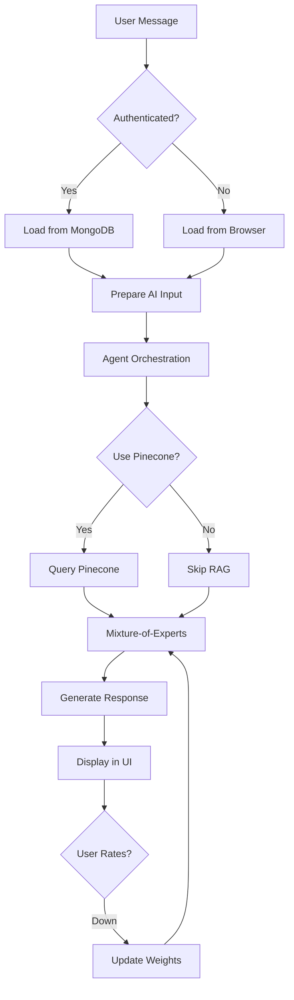

# 🏠 HomeMind — AI-Powered Intelligent Home Search Assistant

> **Finding your dream home through AI-driven insights** 🚀✨

A full-stack, AI-powered real estate chatbot that **aggregates**, **analyzes**, and **recommends** properties with intelligent RAG, graph enrichment, and a Mixture-of-Experts ensemble—built for Chapel Hill, NC and surrounding areas (Durham, Raleigh, Cary, Apex, Morrisville, Hillsborough).

[](https://homemind.vercel.app/)
[](https://homemind-backend.vercel.app/api-docs)

---

## ✨ What Makes HomeMind Special

🎯 **Smart Recommendations** — Hybrid RAG (Pinecone + Neo4j) delivers hyper-personalized property suggestions  
🤖 **AI-Powered** — Mixture-of-Experts with 5 specialized sub-models + merger for maximal relevance  
🔍 **Intelligent Search** — kNN vector similarity + graph traversal for explainable matches  
📊 **Interactive Charts** — AI-generated Chart.js visualizations embedded in chat  
💬 **Real-Time Streaming** — Words appear live as the AI generates responses  
⭐ **Feedback Loop** — Thumbs up/down adjusts expert weights per conversation  
🗺️ **Map Integration** — View properties on Leaflet map with Zillow deep links  
📈 **Insights & Tools** — Graph explainability, mortgage calculators, deal analyzer  
🌐 **Guest Mode** — Use without signing up; history saved locally  
🎨 **Modern UI** — Dark/light mode, Framer Motion animations, responsive design  

---

## 🧰 Tech Stack

### Frontend


### Backend


### AI & ML


### DevOps & Deployment


---

## 📋 Table of Contents

- [🚀 Quick Start](#-quick-start)
- [🏗️ Architecture](#️-architecture)
- [🎨 Features](#-features)
- [📦 Project Structure](#-project-structure)
- [🔧 Components](#-components)
- [🤖 AI Pipeline](#-ai-pipeline)
- [🧪 Testing](#-testing)
- [🚢 Deployment](#-deployment)
- [📄 License](#-license)
- [📬 Contact](#-contact)

---

## 🚀 Quick Start

### Run Everything Locally

```bash
# 1. Clone the repository
git clone https://github.com/SergioSediq/HomeMind.git
cd HomeMind

# 2. Backend setup
cd backend
npm install
cp ../.env.example .env
# Edit .env with MONGO_URI, GOOGLE_AI_API_KEY, PINECONE_API_KEY, etc.

# 3. Create Pinecone index (optional, if not exists)
npm run pinecone:create

# 4. Upsert properties to Pinecone (requires data files)
# npm run upsert

# 5. Start backend
npm start
# Backend runs on http://localhost:3001

# 6. Frontend (new terminal)
cd ../frontend
npm install
echo "NEXT_PUBLIC_API_URL=http://localhost:3001" > .env.local
npm run dev
# Frontend runs on http://localhost:3000
```

### Run Both Together

```bash
# From project root
npm run dev
# Starts frontend + backend concurrently
```

📚 **Full setup guide:** See [Components](#-components) below

---

## 🏗️ Architecture

### System Overview



### Hybrid RAG Flow



### 🧩 Key Services

| Service | Description | Live URL |
|---------|-------------|----------|
| 🎨 **Frontend** | Next.js chat UI, insights, map | [homemind.vercel.app](https://homemind.vercel.app/) |
| ⚙️ **Backend** | Express API with AI & RAG | [homemind-backend.vercel.app](https://homemind-backend.vercel.app/) |

---

## 🎨 Features

- **Intelligent Property Recommendations** — Hybrid RAG (vector + graph) for tailored suggestions  
- **Secure Auth** — JWT signup/login with profile management  
- **Conversation History** — Save, rename, delete, search chats (auth) or local storage (guest)  
- **Auto-Generated Titles** — AI titles for new conversations in seconds  
- **Mixture-of-Experts** — Data Analyst, Lifestyle Concierge, Financial Advisor, Neighborhood Expert, Cluster Analyst  
- **Expert View Toggle** — Switch between combined or single-expert responses  
- **Rating System** — Thumbs up/down adjusts expert weights per conversation  
- **Interactive Charts** — AI-generated Chart.js graphs in chat  
- **Insights Page** — Graph explainability, mortgage tools, neighborhood stats  
- **Deal Analyzer** — AI/ML evaluation at `/analyzer`  
- **Forums** — Community discussions at `/forums`  
- **Map Page** — Leaflet map with `?zpids=` or `?q=` search  
- **Real-Time Streaming** — SSE-powered live response generation  
- **Dark/Light Mode** — Theme toggle with saved preference  
- **VS Code Extension** — Chat from your editor  

---

## 📦 Project Structure

```
HomeMind/
├── 🎨 frontend/          # Next.js web application
├── ⚙️ backend/           # Express.js API server
├── 🤖 agentic-ai/        # Multi-agent AI pipeline
├── 📡 mcp/               # Model Context Protocol server
├── 🔌 extension/         # VS Code extension
├── 🏗️ helm/              # Kubernetes Helm charts
├── ☁️ aws/ azure/ gcp/   # Cloud deployment configs
├── 📜 terraform/         # Infrastructure as Code
├── 🐳 docker/            # Docker configs
└── 📚 docs/              # Documentation
```

---

## 🔧 Components

### 🎨 Frontend

**Next.js app with chat, insights, map, and analytics**

#### ✨ Key Features
- 💬 **Chat Interface** — Markdown, streaming, expert views, inline charts  
- 🔍 **Conversation Search** — Full-text search across history  
- 🗺️ **Map** — Leaflet markers, Zillow links, `?zpids=` deep linking  
- 📊 **Insights** — Graph tools, mortgage calculators, neighborhood stats  
- 🔐 **Auth** — JWT login, signup, profile, password reset  
- 🌓 **Dark Mode** — Smooth theme toggle  
- 📱 **Responsive** — Mobile-first design  

#### 🚀 Getting Started

```bash
cd frontend
npm install
npm run dev  # http://localhost:3000
```

#### 📝 Configuration

Create `frontend/.env.local`:

```env
NEXT_PUBLIC_API_URL=http://localhost:3001
```

---

### ⚙️ Backend

**Express.js API with AI, RAG, and graph integration**

#### ✨ Key Features
- 🤖 **Google Gemini** — LLM for chat & expert routing  
- 📐 **Pinecone** — Vector search for property retrieval  
- 🔗 **Neo4j** — Graph enrichment for explainable recommendations  
- 🗄️ **MongoDB** — Users, conversations, forum posts  
- ⚡ **Redis** — Caching layer  
- 🔐 **JWT Auth** — Secure sessions  
- 📊 **Swagger** — API docs at `/api-docs`  

#### 🚀 Getting Started

```bash
cd backend
npm install
npm run pinecone:create  # Create index if needed
npm start  # http://localhost:3001
```

#### 📝 Configuration

Create `backend/.env` (see root `.env.example`):

```env
PORT=3001
MONGO_URI=mongodb://...
JWT_SECRET=...
GOOGLE_AI_API_KEY=...
PINECONE_API_KEY=...
PINECONE_INDEX=homemind-index
NEO4J_ENABLE=false
NEO4J_URI=...
```

---

## 🤖 AI Pipeline

**Agentic AI with Hybrid RAG & Mixture-of-Experts**

### ✨ Key Techniques
- **Hybrid RAG** — Pinecone kNN + Neo4j graph enrichment  
- **Decision Agent** — Routes to RAG or MoE based on query  
- **Mixture-of-Experts** — 5 experts + merger for specialized responses  
- **Chain-of-Thought** — Step-by-step reasoning per expert  
- **Feedback Loop** — Thumbs up/down updates expert weights  
- **k-Means Clustering** — Groups similar properties  

### 🏗️ Flow



📚 **Full RAG docs:** [RAG_SYSTEM.md](RAG_SYSTEM.md)

---

## 🧪 Testing

### Backend Tests

```bash
cd backend
npm test
npm run test:coverage
```

### Frontend Tests

```bash
cd frontend
npm test
npm run cypress:open   # E2E
npm run test:selenium  # Selenium E2E
```

---

## 🚢 Deployment

### 🌐 Vercel (Recommended)

- **Frontend:** Connect repo to Vercel, auto-deploy from `frontend/`  
- **Backend:** Deploy via `vercel.json` in `backend/`  

### 🐳 Docker

```bash
docker-compose up --build
```

### ☁️ Multi-Cloud

- **AWS** — ECS Fargate, Terraform in `aws/`  
- **Azure** — Container Apps, Bicep in `azure/`  
- **GCP** — Cloud Run, configs in `gcp/`  
- **Kubernetes** — Helm charts in `helm/`  

📚 **Full deployment guide:** [DEPLOYMENTS.md](DEPLOYMENTS.md)

---

## 📜 License

**MIT License** — Free to use, modify, and distribute.

See [LICENSE](LICENSE) for details.

---

## 📬 Contact

**Sergio Sediq** — Project Maintainer

[](https://www.linkedin.com/in/sedyagho)
[](mailto:sediqsergio@gmail.com)
[](https://github.com/SergioSediq)

---

## 🌟 Acknowledgments

Built with ❤️ using:
- [Next.js](https://nextjs.org/) — React framework
- [Google Gemini](https://ai.google.dev/) — LLM
- [Pinecone](https://www.pinecone.io/) — Vector database
- [Neo4j](https://neo4j.com/) — Graph database
- [Vercel](https://vercel.com/) — Deployment platform

---

## 📚 Additional Documentation

| Document | Description |
|----------|-------------|
| [TECH_DOCS.md](TECH_DOCS.md) | Technical documentation |
| [RAG_SYSTEM.md](RAG_SYSTEM.md) | Hybrid RAG architecture |
| [DEPLOYMENTS.md](DEPLOYMENTS.md) | Deployment guides |
| [GRPC_TRPC.md](GRPC_TRPC.md) | gRPC & tRPC APIs |
| [mcp/README.md](mcp/README.md) | MCP server tools |
| [extension/README.md](extension/README.md) | VS Code extension |

---

<p align="center">
  <strong>⭐ Star this repo if you find it useful!</strong><br>
  <sub>Made with 🤖 AI and 💪 dedication</sub>
</p>
