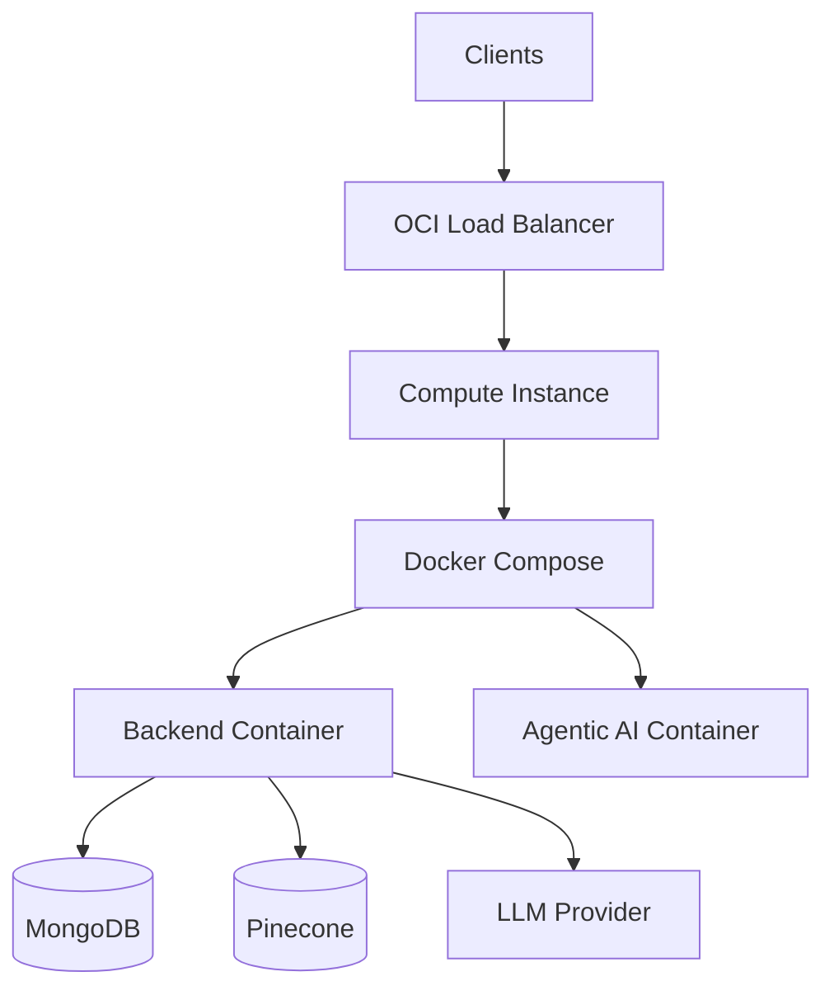

# Oracle Cloud (OCI) Deployment

Production-ready Oracle Cloud Infrastructure (OCI) deployment for homemind using Terraform, OCI Container Registry (OCIR), and a hardened compute instance running Docker Compose. The layout mirrors the AWS/Azure/GCP options while staying OCI-native.

## Architecture



## Prerequisites

- OCI tenancy + compartment
- OCI API key and config (`~/.oci/config` or env vars)
- Terraform >= 1.5
- Docker installed locally to build/push images
- OCIR repository for your tenancy

## Build and Push Images to OCIR

```bash
export OCI_TENANCY_NAMESPACE="<tenancy-namespace>"
export OCI_REGION="<region>"
export OCI_USER="<oracle-cloud-username>"

./oracle-cloud/scripts/push-images.sh \
  --region "$OCI_REGION" \
  --namespace "$OCI_TENANCY_NAMESPACE" \
  --backend-repo homemind-backend \
  --agentic-repo homemind-agentic \
  --tag latest
```

## Terraform Deploy

1. Copy the example variables file and fill in values:

```bash
cp oracle-cloud/terraform/terraform.tfvars.example oracle-cloud/terraform/terraform.tfvars
```

2. Apply:

```bash
cd oracle-cloud/terraform
terraform init
terraform apply
```

## Key Variables

- `enable_load_balancer` (default true)
- `instance_in_private_subnet` (default true)
- `backend_image`, `agentic_image`
- `mongo_uri`, `jwt_secret`, `google_ai_api_key`, `pinecone_api_key`
- `neo4j_*` values if graph is enabled

See `oracle-cloud/terraform/variables.tf` for the full list.

## OCIR Pull Credentials

Provide these in `terraform.tfvars`:

- `ocir_registry` (e.g., `iad.ocir.io`)
- `ocir_username` (tenancy/namespace/username)
- `ocir_auth_token` (OCI auth token)

Terraform injects credentials into cloud-init and performs `docker login` before starting services.

## Runtime Configuration

Terraform templates generate:

- `/opt/homemind/.env`
- `/opt/homemind/docker-compose.yml`

To update config after first boot:

```bash
sudo /opt/homemind/scripts/update-env.sh
sudo docker compose -f /opt/homemind/docker-compose.yml up -d
```

## Outputs

Terraform outputs include:
- Compute public IP
- Load balancer IP (if enabled)
- Instance ID and VCN IDs

## HTTPS / TLS

To enable TLS on the load balancer, set `tls_certificate_path` and `tls_private_key_path` in `terraform.tfvars`. Optional CA bundles are supported for full chain configuration.

## File Layout

```
oracle-cloud/
├── docker/
│   ├── agentic.Dockerfile
│   └── backend.Dockerfile
├── scripts/
│   └── push-images.sh
├── templates/
│   ├── cloud-init.yaml.tmpl
│   ├── docker-compose.yaml.tmpl
│   └── env.tmpl
└── terraform/
    ├── compute.tf
    ├── load_balancer.tf
    ├── networking.tf
    ├── outputs.tf
    ├── providers.tf
    ├── security.tf
    ├── terraform.tfvars.example
    └── variables.tf
```

## Notes

- Default shape: `VM.Standard.E4.Flex` (2 OCPU / 16 GB RAM).
- Keep the load balancer enabled for TLS termination and stable ingress.
- Consider OCI Vault if you need managed secrets instead of `.env` files.
